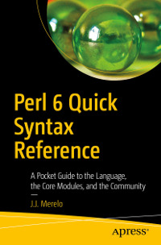

# Apress Source Code

This repository accompanies [*Perl 6 Quick Syntax Reference*](https://www.apress.com/9781484249550) by J.J. Merelo (Apress, 2019).

[comment]: #cover

Download the files as a zip using the green button, or clone the
repository to your machine using Git.

## Chapter 14

This is intended as a standalone repo, which is an example of a module
that could be released to the ecosystem. Please find
it
[in its own repo](https://github.com/Apress/perl6-quick-syntax-reference-ch14). 

## Releases

Release v1.0 corresponds to the code in the published book, without corrections or updates.

## Contributions

See the file Contributing.md for more information on how you can contribute to this repository.
